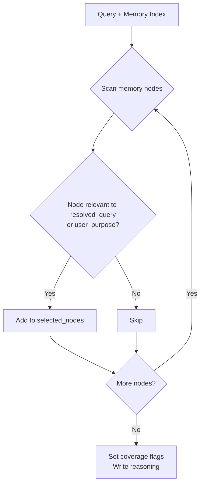

# Phase 2.1: Context Gatherer — Retrieval

Select relevant memory nodes for the current query. Do NOT load full documents.

---

## Output Schema

```json
{
  "selected_nodes": {
    "turn_summary": ["[node_id]"],
    "preference": ["[node_id]"],
    "fact": ["[node_id]"],
    "research_cache": ["[node_id]"],
    "visit_record": ["[node_id]"]
  },
  "selection_reasons": {
    "turn_summary": "[why these turns matter]",
    "preference": "[why these prefs matter]",
    "fact": "[why these facts matter]",
    "research_cache": "[why this cache matters]",
    "visit_record": "[why these visits matter]"
  },
  "coverage": {
    "has_prior_turns": true | false,
    "has_memory": true | false,
    "has_cached_research": true | false,
    "has_visit_data": true | false
  },
  "reasoning": "[short narrative rationale]"
}
```

---

## Decision Logic



### Selection Rules

| Signal | Action |
|--------|--------|
| `resolved_query` mentions `[site]` or `[topic]` | Select matching turn_summary and visit_record nodes |
| `user_purpose` implies follow-up | Select N-1 turn node (critical for continuity) |
| Preference node matches query domain | Select preference node |
| Research cache covers query topic | Select research_cache node |
| No matching nodes for a source_type | Use empty array, set coverage flag to false |

---

## Do NOT

- Fabricate node_ids — use ONLY ids from the Unified Memory Index
- Load or read full documents — just select which nodes are relevant
- Omit required keys — all source_type keys must exist (empty arrays if none)
- Ignore narrative signal — prefer `resolved_query` + `user_purpose` over structured hints
