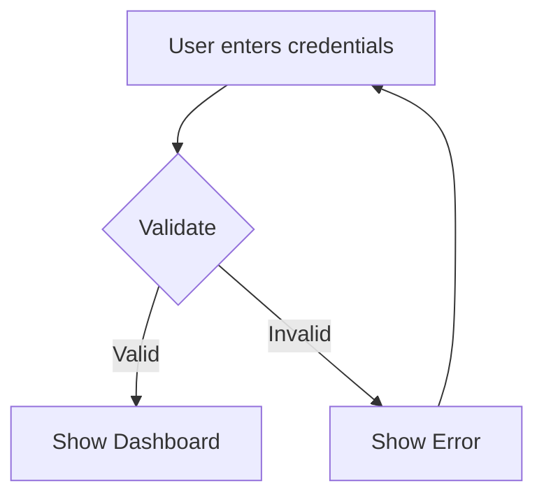

## Mermaid Diagram Generator

Generate Mermaid.js diagrams from natural language descriptions.

### Supported Diagram Types

| Type | Best For | Example Trigger |
|------|----------|-----------------|
| flowchart | Processes, decisions, flows | "diagram the login process" |
| sequenceDiagram | Interactions over time | "show API request flow" |
| classDiagram | Class structures | "diagram the User class hierarchy" |
| stateDiagram | State machines | "show order states" |
| erDiagram | Database schemas | "diagram the database tables" |
| gantt | Project timelines | "create a project timeline" |
| pie | Proportions | "show budget breakdown" |
| mindmap | Hierarchical concepts | "mind map for project planning" |

### Example

**Input:**
```
description: "User login flow: user enters credentials, system validates,
              if valid show dashboard, if invalid show error and retry"
diagram_type: auto
```

**Output:**


### Usage Notes

- The generated code can be rendered in VS Code, Obsidian, GitHub, or any Mermaid-compatible viewer
- For complex diagrams, provide detailed descriptions with clear entity names
- Use specific diagram types when you know what you want; use "auto" to let the LLM choose
