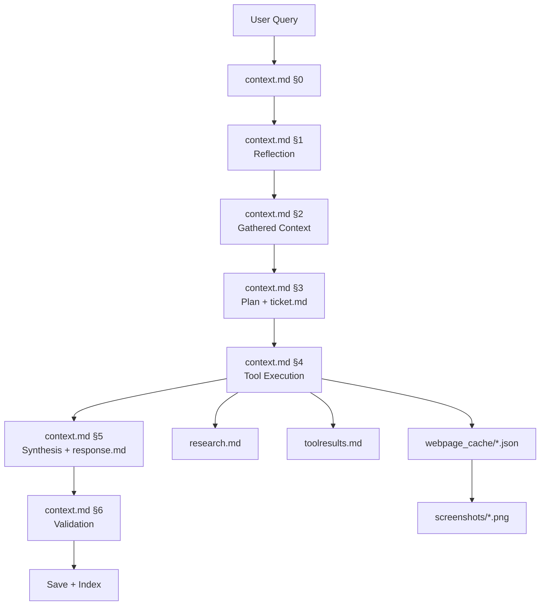

# PandaAI v2 (Modular, Prompt-Managed Architecture)

**Status:** Proposed Architecture  
**Created:** 2026-01-03  
**Purpose:** Outline a more modular, service-oriented system that leans hard into the recipe prompt system and the `context.md` document pipeline while keeping LLMs responsible for complex decisions.

---

## 1. Goals

- Increase modularity without reducing capability or LLM ownership of decisions.
- Make each service small, single-purpose, and replaceable.
- Preserve the `context.md` single-source-of-truth model.
- Treat prompts + recipes as the control plane.
- Keep Obsidian as a human navigation layer, not a data source.

### 1.1 Accuracy and Scale Priorities

- Accuracy is the top priority; speed is explicitly last.
- Evidence discipline is mandatory: claims must link to documents or artifacts.
- Retrieval-first routing: search TurnIndexDB/ResearchIndexDB before new research.
- Strong validation loop: approve/revise/retry gates with confidence thresholds.
- Multi-model specialization: tiny models handle narrow sections, escalate when needed.
- Observability is a product feature: decision trails and quality scores are logged.
- Scale comes from stateless services, queues, and clear IO contracts.
- QA/traceability is first-class: every decision is documented, evidence-linked, and retrievable.

### 1.2 Self-Extending Capability Scale

- The system can add new tools, prompts, and recipes when a capability gap is detected.
- All additions follow the same prompt-managed, document-based rules.
- Growth is governed by specs, schemas, tests, and observability, not ad hoc code.

### 1.3 Hardware Baseline (RTX 4060 Laptop, Windows)

- Target model: **7B class, 4-bit** (primary), with 8k context as default.
- Recommended baseline: Qwen2.5-7B Instruct (or Coder for tool-heavy flows).
- Conservative context budget: **8k** for stability on laptop GPUs.
- Quality ceiling remains 12k per-call when headroom allows and evals pass.
- Prefer WSL2 for Linux-first tooling and minimal migration friction.

### 1.4 Model Selection + Eval Plan (RTX 4060)

- Primary model: **Qwen2.5-7B Instruct** (or **Qwen2.5-7B Coder** for tool/code-heavy work).
- Alternate: **Llama 3.1 8B** if license and access are acceptable.
- Trainability: LoRA/QLoRA-first fine-tuning; keep base weights intact.
- Default context: **8k**, with 12k only after evals confirm stable accuracy.

**Evaluation loop (minimal but strict):**
1. Run a small fixed suite across Reflection, Planner, Coordinator, Synthesis, Validation.
2. Compare accuracy at 8k vs 12k prompt packs using the same tasks.
3. Track schema compliance, evidence-link rate, and validation pass rate.
4. Promote context size only if quality improves without extra retries.

**Optional confidence technique:** DeepConf-style test-time filtering can reduce low-quality traces
in Planner/Coordinator without extra training.

### 1.5 External References (Model/Confidence)

- Qwen2.5-7B Instruct model card: https://huggingface.co/Qwen/Qwen2.5-7B-Instruct/raw/main/README.md
- Llama 3.1 8B (context length summary): https://ollama.com/library/llama3.1:8b
- Deep Think with Confidence (DeepConf) arXiv: https://arxiv.org/abs/2508.15260
- Deep Think with Confidence (Meta AI): https://ai.meta.com/research/publications/deep-think-with-confidence/

### 1.6 Hybrid Escalation + Learning Loop

- v2 runs a **small local model** by default (fast, cheap, modular).
- When confidence is low or a capability gap is detected, it **escalates to a larger server model**.
- The server model’s answer is written back into `context.md` and indexed in TurnIndexDB.
- Future turns reuse the learned context via retrieval, not hardcoded rules.
- Learning is governed by evidence, validation, and TTL/quality gates (not blind permanence).

---

## 2. Core Principles (Non-Negotiable)

1. **LLM-First Decisions**  
   All complex routing, planning, source selection, navigation, and validation live in prompts.

2. **Recipe-Driven Control Plane**  
   Every LLM call is executed via a recipe that defines IO schema and token budgets.

3. **Document-Based IO**  
   `context.md` accumulates the full turn. Other docs are linked artifacts (`research.md`, `toolresults.md`, `webpage_cache/*.json`).

4. **Context Discipline**  
   The original user query and linked evidence are always included in the prompt pack.

5. **Small Services, Strong Contracts**  
   Each service reads a document pack, writes one section or artifact, and exits.

---

## 3. High-Level Shape

**Control Plane (LLM-owned decisions):**
- Prompt Registry + Recipes
- Prompt Pack Compiler
- LLM Role Executors (Reflection, Planner, Coordinator, Synthesis, Validation)

**Execution Plane (code-owned actions):**
- Tool Runner
- Web Navigation (UIVisionAgent + PageDocument)
- Research Pipelines
- Automation (n8n)

**State Plane (documents and indexes):**
- Document Store (`panda_system_docs/`)
- TurnIndexDB, ResearchIndexDB
- Cache stores (tool/response/claims)

---

## 4. Service Modules (Small, Focused)

### 4.1 API Gateway
**Responsibility:** Accepts user requests, creates a new turn, hands off to the Turn Controller.  
**Input:** User request  
**Output:** Turn ID + initial `context.md §0`

### 4.2 Turn Controller
**Responsibility:** Orchestrates the phase pipeline across services.  
**Input:** Turn ID  
**Output:** Phase transitions + lifecycle tracking

### 4.3 Prompt Registry Service
**Responsibility:** Catalog prompts, versions, IO schemas, risk tags.  
**Input:** Prompt files + recipes  
**Output:** Prompt metadata index

### 4.4 Prompt Pack Compiler
**Responsibility:** Build prompt packs from `context.md` + linked docs.  
**Input:** Turn ID + recipe  
**Output:** Prompt pack (structured)

### 4.5 Context Gatherer Service
**Responsibility:** Searches TurnIndexDB/ResearchIndexDB and compiles `context.md §1`.  
**Input:** Turn ID, user query  
**Output:** Updated `context.md §1`

### 4.6 Reflection Service
**Responsibility:** LLM decides PROCEED vs CLARIFY.  
**Input:** `context.md`  
**Output:** `context.md §2`

### 4.7 Planner Service
**Responsibility:** LLM builds task plan, selects route, defines tool intent.  
**Input:** `context.md`  
**Output:** `context.md §3` + `ticket.md`

### 4.8 Coordinator Service
**Responsibility:** LLM chooses tool calls and sequence.  
**Input:** `context.md` + `ticket.md`  
**Output:** `context.md §4` + tool calls

### 4.9 Tool Runner Service
**Responsibility:** Executes MCP tools, returns raw bundles.  
**Input:** Tool calls  
**Output:** `toolresults.md`, `research.md`, `webpage_cache/*.json`

### 4.10 Web Navigation Service
**Responsibility:** OCR + DOM capture, build PageDocument, LLM-driven navigation.  
**Input:** URL + navigation intent  
**Output:** `webpage_cache/*.json`, screenshots, html snapshots

### 4.11 Synthesis Service
**Responsibility:** LLM creates final answer from `context.md`.  
**Input:** `context.md`  
**Output:** `context.md §5` + `response.md`

### 4.12 Validation Service
**Responsibility:** LLM approves or requests revise/retry.  
**Input:** `context.md` + `response.md`  
**Output:** `context.md §6`

### 4.13 Save/Index Service
**Responsibility:** Persist docs, update indexes, write metrics.  
**Input:** Turn artifacts  
**Output:** TurnIndexDB / ResearchIndexDB updates

### 4.14 Observability Service
**Responsibility:** Extract decision trail + metrics into `metrics.json`.  
**Input:** `context.md`, tool logs  
**Output:** `metrics.json`, observability rollups

### 4.15 Agent Router Service (Optional Multi-Model)
**Responsibility:** LLM decides which agent (Claude, ChatGPT, primary) to invoke.  
**Input:** Prompt pack + task intent  
**Output:** `agent_output.md` with provenance

### 4.16 Automation Service (n8n)
**Responsibility:** Ingest and execute external workflows (email, social, reddit).  
**Input:** Automation events or `automation.execute` calls  
**Output:** `automation.md` + tool results

### 4.17 Capability Builder Service
**Responsibility:** Generate new tool specs, prompts, and recipes when gaps are detected.  
**Input:** `capability_request.md`, example tasks, policy constraints  
**Output:** `tool_spec.md`, `prompt_spec.md`, `recipes/*.yaml`, eval cases

---

## 5. Document System (Still the Spine)

**Single-source-of-truth:** `context.md` accumulates §0–§6 per turn.  
**Linked evidence:** `research.md`, `toolresults.md`, `webpage_cache/*.json`, `metrics.json`.  
**Indexing:** TurnIndexDB + ResearchIndexDB make prior work searchable.  
**Obsidian:** Add frontmatter + wikilinks for human navigation without changing storage.

---

## 6. Prompt/Recipe Alignment

- Each LLM service executes a recipe tied to its role.
- Recipes define token budgets, required sections, and output schema.
- Prompt packs are built from `context.md` + linked docs; no raw tool outputs unless linked.
- All LLM decisions are logged for evaluation and regression tracking.

### 6.1 Self-Extending Capability Loop

When the system encounters a task it cannot complete with existing tools/prompts:

1. **Detect Gap**  
   Planner writes a short `capability_request.md` describing the missing capability.

2. **Spec Authoring (LLM)**  
   A tool-author prompt generates:
   - `tool_spec.md` (IO schema, constraints, error handling)
   - `prompt_spec.md` (new prompts and output schema)
   - `recipes/*.yaml` (token budgets + schema enforcement)

3. **Scaffold + Validate (Code)**  
   - Create tool stubs and minimal tests.
   - Run eval cases to verify schema compliance.

4. **Register + Observe**  
   - Update tool registry and prompt registry.
   - Log outcomes and quality scores for regression tracking.

**Governance:** Low-quality or risky capabilities require escalation or human approval.

### 6.2 Context Budget Default

- Default per-call budget remains **12k tokens** (input + output combined).
- Prompt packs should stay under this budget via SmartSummarizer and section limits.
- Treat 12k as the quality ceiling unless a model with proven long-context performance is adopted.

### 6.3 Quality Gates (Eval + Confidence)

Each phase must pass explicit gates before the turn can proceed:

- **Schema Gate:** Output must match the role schema; otherwise retry/escalate.
- **Evidence Gate:** Claims must link to documents/artifacts; no unlinked claims.
- **Confidence Gate:** If confidence is below threshold, escalate to larger model or request clarification.
- **Validation Gate:** Phase 6 decides APPROVE/REVISE/RETRY based on quality.
- **Regression Gate:** Prompt/tool updates require eval suite pass; block regressions.
- **Freshness Gate:** If retrieved knowledge is stale (TTL expired), re-research before use.

---

## 7. Tiny-Model Section Writers (Partial Context)

**Goal:** Let small LLMs write one section at a time without loading the full `context.md`.

### 7.1 Section Contracts

Each role owns a single section and only sees minimal inputs required for that section:

| Role | Writes | Minimal Inputs (Prompt Pack) |
|------|--------|------------------------------|
| Context Gatherer | `context.md §1` | user query, TurnIndexDB results, selected prior docs |
| Reflection | `context.md §2` | `§0`, `§1`, reflection policy |
| Planner | `context.md §3` + `ticket.md` | `§0`, `§1`, `§2`, relevant docs |
| Coordinator | `context.md §4` | `§0`–`§3`, `ticket.md` |
| Synthesis | `context.md §5` + `response.md` | `§0`–`§4`, linked evidence |
| Validation | `context.md §6` | `§0`–`§5`, `response.md` |

### 7.2 Section Writer Rules

- A section writer **never edits other sections**.
- A section writer **does not require full context.md**, only its minimal inputs.
- Outputs are validated against strict schemas; low-confidence outputs trigger retry or escalation.
- A dedicated **Aggregator** appends each section in order to keep `context.md` canonical.

### 7.3 Escalation Path

If a tiny model fails (low confidence, schema errors, or repeated retries), the system:
1. retries with a stronger model for that section
2. logs the failure as a prompt-quality issue
3. updates the recipe or prompt, not code rules

---

## 8. Turn Flow (Modular Services)

```
API → Turn Controller
  → Context Gatherer → Reflection → Planner
  → Coordinator → Tool Runner (+ Web Navigation / Research)
  → Synthesis → Validation → Save/Index
```

Each step is a discrete service with a clean input/output contract.

---

## 9. Obsidian Compatibility (Human Layer)

- Add dual links (relative + wikilink).
- Add YAML frontmatter for fast filtering.
- Use wrapper notes for JSON artifacts.

Obsidian remains optional and never becomes the source of truth.

---

## 10. Migration Strategy (Outline)

1. Split current unified flow into service-boundary modules.  
2. Introduce prompt registry + recipe enforcement per role.  
3. Add dedicated tool runner and web navigation service.  
4. Add automation service hooks (n8n).  
5. Expand observability per service boundary.

---

## 11. Success Criteria

- Each service has a single responsibility and a clear IO contract.
- All decisions remain prompt-driven.
- `context.md` remains the canonical turn record.
- Obsidian improves human navigation without altering system behavior.

---

## 12. Visual Map (Service Web)

```mermaid
flowchart LR
  API[API Gateway] --> TC[Turn Controller]

  subgraph ControlPlane[Control Plane (LLM Decisions)]
    PR[Prompt Registry]
    PPC[Prompt Pack Compiler]
    CG[Context Gatherer]
    REF[Reflection]
    PL[Planner]
    CO[Coordinator]
    SYN[Synthesis]
    VAL[Validation]
    CAPB[Capability Builder]
  end

  subgraph ExecutionPlane[Execution Plane (Code Actions)]
    TR[Tool Runner]
    WEB[Web Navigation]
    AUTO[Automation (n8n)]
  end

  subgraph StatePlane[State Plane (Documents + Indexes)]
    DOCS[Document Store\ncontext.md + linked docs]
    TIDX[TurnIndexDB]
    RIDX[ResearchIndexDB]
    CACHE[Cache Stores]
  end

  TC --> CG --> REF --> PL --> CO --> TR
  PL -.-> CAPB
  TR --> WEB
  TR --> AUTO
  CO --> SYN --> VAL --> SAVE[Save/Index]

  SAVE --> DOCS
  DOCS --> TIDX
  DOCS --> RIDX
  DOCS --> CACHE

  TIDX --> CG
  RIDX --> CG

  DOCS --> PPC
  PPC --> REF
  PPC --> PL
  PPC --> CO
  PPC --> SYN
  PPC --> VAL
  CAPB --> PR
  CAPB --> DOCS
```

---

## 13. Visual Map (Document Spine)


