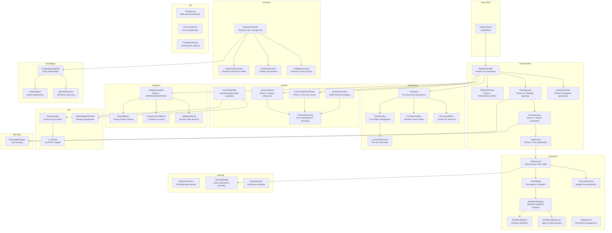
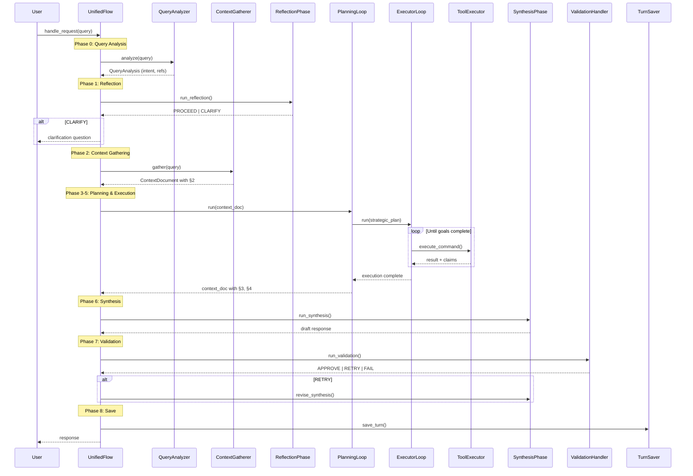

# Gateway Module Index

The Gateway is the orchestration layer for the Panda AI system. It implements a 9-phase document pipeline where a single LLM plays multiple roles through structured prompts.

## Architecture Overview



## Module Descriptions

### Entry Point

| File | Description |
|------|-------------|
| `unified_flow.py` | Main orchestrator (1400 lines). Coordinates the 9-phase pipeline, initializes all components, delegates to extracted modules via callbacks. |

### orchestration/

Phase coordination loops extracted from UnifiedFlow.

| File | Description |
|------|-------------|
| `request_handler.py` | Orchestrates Phases 0-8, handles retries on validation failure |
| `reflection_phase.py` | Phase 1: Evaluates context sufficiency, outputs PROCEED/CLARIFY |
| `planning_loop.py` | Phase 3-5: Strategic planning with Planner → Executor → Coordinator |
| `executor_loop.py` | Phase 4 tactical: Issues natural language commands to Coordinator |
| `agent_loop.py` | Phase 5 tool expert: Translates commands to tool calls |
| `synthesis_phase.py` | Phase 6: Generates draft response from context |

### context/

Context document management and query analysis.

| File | Description |
|------|-------------|
| `context_document.py` | Core `ContextDocument` class - accumulating §0-§7 sections |
| `query_analyzer.py` | Phase 0: Intent classification, reference resolution, multi-task detection |
| `context_gatherer_2phase.py` | Phase 2: Two-phase context gathering (RETRIEVAL + SYNTHESIS) |
| `doc_pack_builder.py` | Assembles prompts from recipes with token budget management |
| `section_formatter.py` | Formats §3 (Planning) and §4 (Execution) sections |
| `doc_writers.py` | Low-level document writing utilities |
| `memory_context_builder.py` | Memory-aware context construction |

### execution/

Tool execution, workflows, and safety controls.

| File | Description |
|------|-------------|
| `tool_catalog.py` | Central registry for all tools, handles dispatch |
| `tool_executor.py` | Executes tools with permission validation and claims extraction |
| `tool_registration.py` | Registers all tool handlers with the catalog |
| `workflow_manager.py` | Loads workflows, matches queries to workflows |
| `workflow_step_runner.py` | Step-by-step workflow execution |
| `execution_guard.py` | Token budget checking, circular call detection |
| `tool_approval.py` | Permission system for sensitive tools |
| `permission_validator.py` | Validates tool permissions against rules |
| `tool_metrics.py` | Tool execution metrics tracking |

### validation/

Response validation and quality metrics.

| File | Description |
|------|-------------|
| `validation_handler.py` | Phase 7: Validates response, outputs APPROVE/RETRY/REVISE/FAIL |
| `validation_result.py` | `ValidationResult` dataclass and related types |
| `response_confidence.py` | Calculates aggregate confidence scores |
| `confidence_calibration.py` | Calibrates confidence based on historical accuracy |
| `phase_metrics.py` | `PhaseMetrics` class for timing and token tracking |
| `phase_events.py` | Thinking event emission for UI visualization |

### persistence/

Turn management and document storage.

| File | Description |
|------|-------------|
| `turn_saver.py` | Saves turn documents (context.md, response.md, etc.) |
| `turn_manager.py` | `TurnDirectory` class for turn folder operations |
| `turn_counter.py` | Assigns sequential turn numbers |
| `turn_search_index.py` | Semantic search over prior turns |
| `turn_index_db.py` | SQLite index for turn metadata |
| `document_writer.py` | Writes context.md, ticket.md, toolresults.md |
| `user_paths.py` | `UserPathResolver` for per-user directories |
| `visit_record.py` | Tracks visited URLs to avoid re-crawling |

### research/

Research document management and summarization.

| File | Description |
|------|-------------|
| `research_handler.py` | Coordinates research document writing and knowledge graph updates |
| `research_document.py` | `ResearchDocument` model and writer |
| `research_doc_writers.py` | Research-specific document formatting |
| `research_index_db.py` | SQLite index for research documents |
| `smart_summarization.py` | `SmartSummarizer` for context compression |
| `summarizer_role.py` | LLM-based summarization |
| `intelligence_cache.py` | Caches research results |

### llm/

LLM client and prompt management.

| File | Description |
|------|-------------|
| `llm_client.py` | `LLMClient` wrapper for vLLM API |
| `recipe_loader.py` | Loads prompt recipes from YAML files |
| `token_budget_allocator.py` | Allocates token budgets across phases |

### parsing/

Response parsing and claims extraction.

| File | Description |
|------|-------------|
| `response_parser.py` | `ResponseParser` for JSON and decision parsing |
| `claims_manager.py` | Extracts and summarizes claims from tool results |
| `query_resolver.py` | Resolves N-1 references and clarifications |

### knowledge/

Knowledge graph and entity management.

| File | Description |
|------|-------------|
| `knowledge_graph_db.py` | SQLite-based knowledge graph storage |
| `entity_document.py` | Entity document model |
| `entity_extractor.py` | Extracts entities from text |
| `entity_updater.py` | Updates knowledge graph with new entities |
| `backlink_scanner.py` | Discovers references between entities |

### util/

Shared utilities.

| File | Description |
|------|-------------|
| `panda_loop.py` | `PandaLoop` for multi-task orchestration |
| `error_compactor.py` | Deduplicates and compacts error messages |
| `principle_extractor.py` | Extracts learning principles from failures |
| `cache_manager.py` | General-purpose caching utilities |
| `performance_tracker.py` | Performance metrics collection |
| `unified_reflection.py` | Shared reflection utilities |

### planning/

Plan state management.

| File | Description |
|------|-------------|
| `plan_state.py` | `PlanStateManager` for tracking goals and progress |

### phases/

Alternative phase implementations (legacy/experimental).

| File | Description |
|------|-------------|
| `base.py` | Base phase class |
| `planner_phase.py` | Standalone planner phase |
| `executor_phase.py` | Standalone executor phase |
| `coordinator_phase.py` | Standalone coordinator phase |
| `synthesis_phase.py` | Standalone synthesis phase |
| `validation_phase.py` | Standalone validation phase |

## Data Flow



## Key Patterns

### 1. Callback Pattern
Extracted modules receive callbacks to access UnifiedFlow methods without circular imports:
```python
self.planning_loop.set_callbacks(
    write_context_md=self._write_context_md,
    emit_phase_event=self._emit_phase_event,
    ...
)
```

### 2. Singleton Factories
Most modules provide singleton factory functions:
```python
def get_tool_executor() -> ToolExecutor:
    global _tool_executor
    if _tool_executor is None:
        _tool_executor = ToolExecutor(...)
    return _tool_executor
```

### 3. Recipe-Based Prompts
All LLM calls use recipes loaded from `apps/prompts/pipeline/`:
```python
recipe = load_recipe("pipeline/phase3_planner_chat")
pack = await doc_pack_builder.build_async(recipe, turn_dir)
prompt = pack.as_prompt()
```

### 4. Accumulating Context Document
The `ContextDocument` accumulates sections through the pipeline:
- §0: Query Analysis (intent, references)
- §1: Reflection Decision (PROCEED/CLARIFY)
- §2: Gathered Context (prior turns, research)
- §3: Planning (strategic plan, goals)
- §4: Execution (tool calls, results)
- §5: (unused — Phases 4+5 share §4)
- §6: Synthesis (draft response)
- §7: Validation (APPROVE/RETRY/FAIL)

## File Count by Module

| Module | Files | Purpose |
|--------|-------|---------|
| context | 12 | Context document & gathering |
| execution | 11 | Tool execution & workflows |
| validation | 6 | Response validation |
| persistence | 8 | Turn storage |
| research | 7 | Research documents |
| orchestration | 6 | Phase coordination |
| util | 6 | Shared utilities |
| knowledge | 5 | Knowledge graph |
| llm | 3 | LLM interface |
| parsing | 4 | Response parsing |
| phases | 6 | Legacy phase implementations |
| planning | 1 | Plan state |
| **Total** | **75** | |

## Import Convention

All modules can be imported from the package root for convenience:
```python
from libs.gateway import ContextDocument, ToolExecutor, load_recipe
```

Or from their specific submodules:
```python
from libs.gateway.context.context_document import ContextDocument
from libs.gateway.execution.tool_executor import ToolExecutor
from libs.gateway.llm.recipe_loader import load_recipe
```
